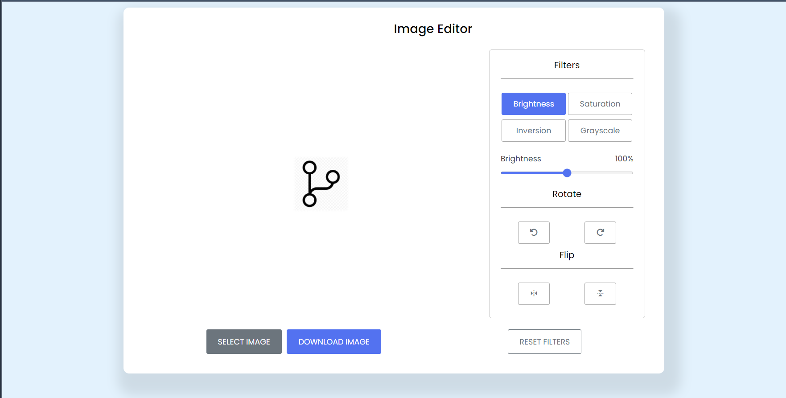

# Image-Editor

An image editor application is a software program that enables users to edit digital images. It provides tools and features for users to manipulate various aspects of an image such as its color, brightness, contrast, and sharpness. The application includes a filter feature that applies pre-set image effects, such as vintage or black and white, to transform the image's appearance. Additionally, it includes a rotate feature to help users achieve their desired image composition.

# Home page

